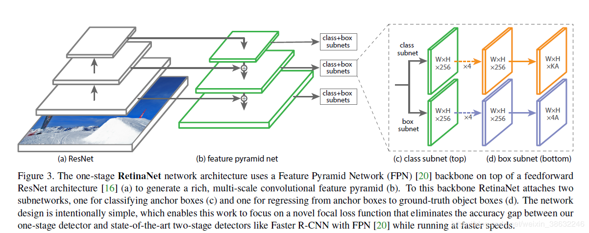
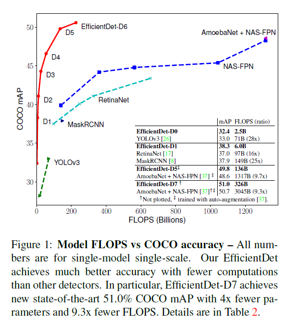
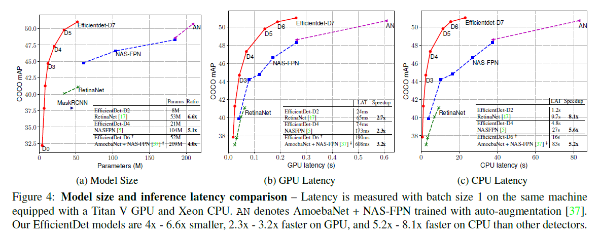
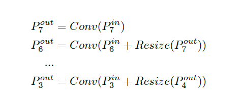
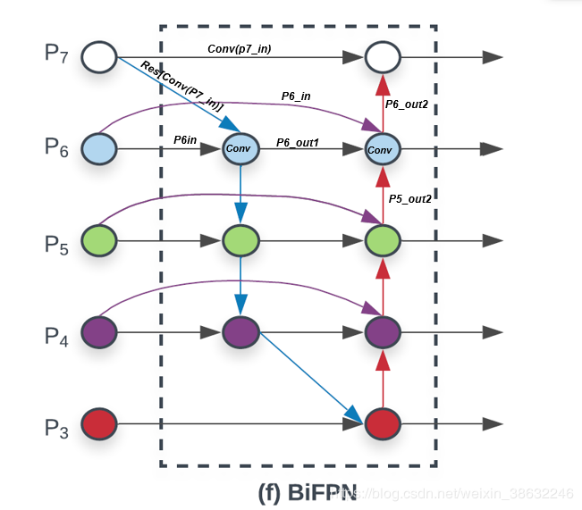
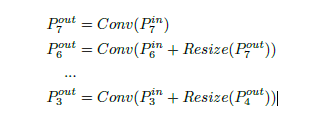
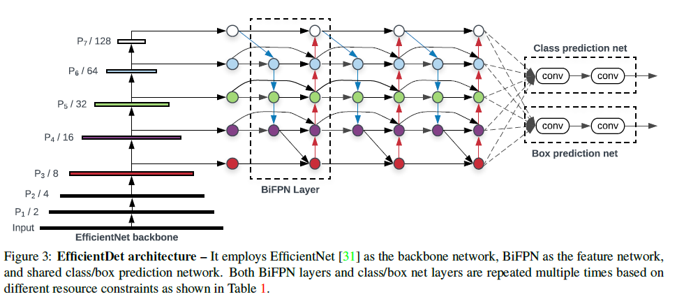
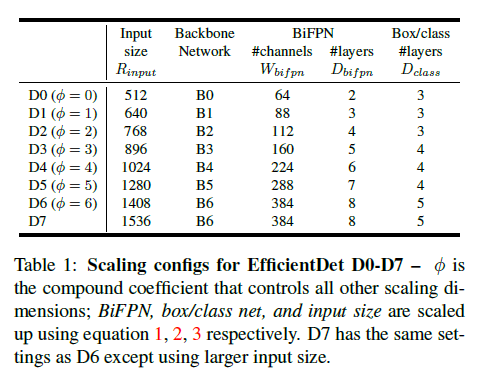
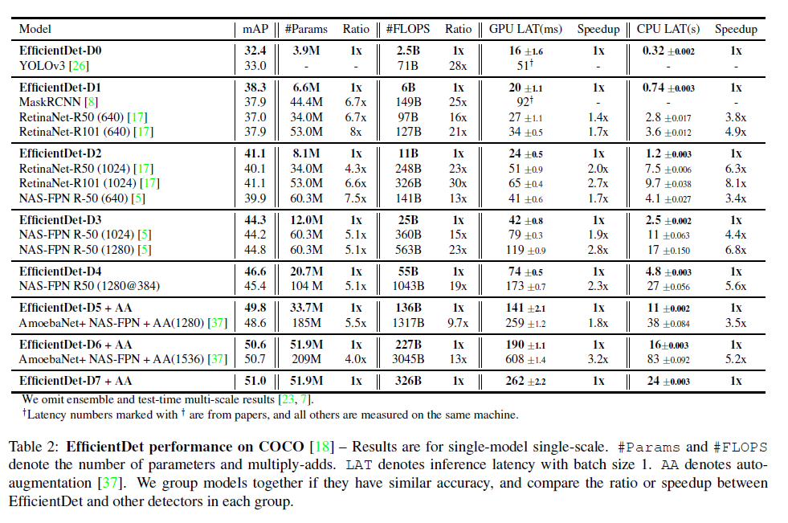

## EfficientDet: Scalable and Efficient Object Detection

论文地址：https://arxiv.org/abs/1911.09070

代码地址：https://github.com/google/automl/tree/master/efficientdet

目前Pytorch开源的SOTA的地址：https://github.com/zylo117/Yet-Another-EfficientDet-Pytorch

EfficientDet改进主要是借鉴了RetinaNet网络，是一种Anchor-base的one stage目标检测方法

**RetinaNet的结构**

是不是感觉很像，EfficientDet网络将ResNet替换成连续的卷积降采样层(EfficientNet)，然后将FPN替换成BIFPN（就是改变原有FPN的连接关系，参考 [FPN详解](https://blog.csdn.net/u014380165/article/details/72890275)），最后将feature map 连接一个分类子网络，一个box回归网络。总结如下：

1. 提出BiFPN子网络结构，双向的多尺度特征融合网络。
2. 提出一种扩展网络的方法，就是扩展backbone，BiFPN，box net 和class net，具体包括网络层数，输入尺寸，深度。
3. 由上面的1,2点，结合得到了EfficientDet一系列网络。

### 0.摘要

模型效率在计算机视觉中的地位越来越重要。本文系统地研究了用于目标检测的各种神经网络结构设计选择，并提出了几种提高效率的关键优化方法。**首先，提出了一种加权双向特征金字塔网络（BiFPN），该网络允许简单快速的多尺度特征融合；其次，提出了一种复合尺度方法，该方法可以同时均匀地对所有骨干网、特征网络和box/class预测网络的分辨率、深度和宽度进行缩放。基于这些优化，Google开发了一个新的目标检测器家族，称为EfficientDet，它在广泛的资源限制范围内始终比现有技术获得一个数量级更好的效率。特别是，在没有钟声和哨声**（without bells and whistles，就是说没搞那些涨精度的tricks，比如各种调参，数据集增强啥的）的情况下，EfficientDet-D7在COCO数据集上实现了最先进的51.0mAP，它有52M参数和326B FLOPS（网络中乘法和加法的数目），体积小了4倍，使用的FLOPS少了9.3倍，但仍然比以前最好的检测器更精确（+0.3%mAP）。

最近在GitHub有大神开源了相对SOTA的Pytorch的实现，推荐尝试。

### 1.介绍

近年来，在更精确的目标检测方面取得了巨大的进展，同时，最先进的目标检测器也变得越来越昂贵。例如，最新的基于 AmoebaNet的NAS-FPN检测器[37]需要167M的参数和3045B的FLOPS（比RetinaNet[17]多30x），才能达到最先进的精度。巨大的模型尺寸和昂贵的计算成本阻碍了它们在许多实际应用中的部署，例如机器人和自动驾驶汽车，在这些应用中，模型尺寸和延迟受到高度限制。考虑到这些现实世界的资源约束，模型效率对于目标检测变得越来越重要。

以前有许多工作旨在开发更高效的检测器架构，如单级[20、25、26、17]和无锚探测器[14、36、32]，或者压缩现有的模型[21，22]。尽管这些方法往往能获得更好的效率，但它们通常会牺牲准确性。此外，以往的研究大多只关注特定或小范围的资源需求，但现实世界中的各种应用，从移动设备到数据中心，往往需要不同的资源约束。

一个自然的问题是：是否有可能在广泛的资源限制（例如从3B到300B的FLOPS）中构建一个既具有更高精度又具有更好效率的可扩展检测体系结构？本文旨在通过系统研究探测器结构的各种设计选择来解决这一问题。基于单级检测器范式，我们研究了主干网、特征融合和box/class网络的设计选择，并确定了两个主要挑战：

**挑战1：高效的多尺度特征融合** 就像在[16]中介绍的那样，FPN在多尺度特征融合中得到了广泛的应用。最近，PANet[19]、NAS-FPN[5]和其他研究[13、12、34]开发了更多的用于跨尺度特征融合的网络结构。在融合不同的输入特征时，以往的研究大多只是简单的归纳，没有区别；然而，由于这些不同的输入特征具有不同的分辨率，我们观察到它们对融合输出特征的贡献往往是不平等的。为了解决这一问题，我们提出了一种简单而高效的加权双向特征金字塔网络（BiFPN），它引入可学习的权值来学习不同输入特征的重要性，同时反复应用自顶向下和自下而上的多尺度特征融合。
**挑战2：模型缩放** 虽然以前的工作主要依赖于更大的主干网络[17、27、26、5]或更大的输入图像大小[8、37]以获得更高的精度，但我们观察到，在兼顾精度和效率的情况下，放大特征网络和box/class预测网络也是至关重要的。在文献[31]的启发下，我们提出了一种目标检测器的复合标度方法，该方法联合提高了所有骨干网、特征网络、box/class预测网络的分辨率/深度/宽度。

最后，我们还观察到，最近引入的EfficientNets[31]比以前常用的主干（例如ResNets[9]、ResNeXt[33]和AmoebaNet[24]）获得更好的效率。将EfficientNet骨干网与我们提出的BiFPN和复合标度相结合，我们开发了一个新的目标检测器家族EfficientDet，与以前的目标检测器相比，它在参数和触发器数量级较少的情况下，始终获得更好的精度。图1和图4显示了COCO数据集的性能比较[18]。在类似的精度限制下，我们的efficientdtet使用的FLOPS比YOLOv3少28倍[26]，比RetinaNet少30倍[17]，比最近的NASFPN少19倍[5]。特别是，在单模型和单测试时间尺度下，我们的EfficientDTET-D7在52M参数和326B FLOPS下实现了最新的51.0 mAP，比以前最好的模型小4倍，使用的触发器少9.3倍，但仍然更精确（+0.3%mAP）[37]。我们的EfficientSet模型在GPU上的速度比以前的探测器快3.2倍，在CPU上的速度比以前的探测器快8.1倍，如图4和表2所示。

我们的贡献可以被总结为：

- 提出了一种用于多尺度特征融合的加权双向特征网络BiFPN。
- 我们提出了一种新的复合缩放方法，该方法联合性地将骨干网、特征网、box/class网和分辨率联合起来进行缩放。
- 基于BiFPN和复合标度，我们开发了EfficientDet，这是一个新的探测器系列，在有广泛资源限制范围的应用中具有显著的更好的精度和效率。

### 2.相关工作

**one-stage检测器：**现有的目标探测器主要根据它们是否有感兴趣的建议步骤（two-stage[6，27，3，8]）区域（one-stage[28，20，25，17]）来分类。虽然two-stage检测器往往更灵活、更精确，但通常认为one-stage检测器通过利用预定义的锚更简单、更高效[11]。近年来，one-stage探测器因其效率高、简单等优点引起了人们的广泛关注[14,34,36]。本文主要遵循one-stage检测器的设计思想，通过优化网络结构，可以达到更高的效率和精度。
**多尺度特征表示：**有效地表示和处理多尺度特征是目标检测的主要难点之一。早期的检测器通常直接根据从骨干网络中提取的金字塔特征层次进行预测[2，20，28]。作为开创性的工作之一，特征金字塔网络（FPN）[16]提出了一种自顶向下的方法来组合多尺度特征。遵循这一思想，PANet[19]在FPN的基础上增加了一个额外的自底向上的路径聚合网络；STDL[35]提出了一个规模转移模块来开发跨规模特征；M2det[34]提出了一个U形模块来融合多规模特征，G-FRNet[1]引入了门单元来控制跨特征的信息流。最近，NAS-FPN[5]利用神经架构搜索自动设计特征网络拓扑。尽管NAS-FPN能获得更好的性能，但它在搜索过程中需要数千个GPU小时，并且生成的特征网络是不规则的，因此很难解释。本文旨在以更直观、更具原则性的方法对多尺度特征融合进行优化。
**模型缩放：**为了获得更好的精度，通常通过使用更大的骨干网络（例如，从移动大小的模型[30，10]和ResNet[9]，到ResNeXt[33]和AmoebaNet[24]）或增加输入图像大小（例如，从512x512[17]到1536x1536[37]）来放大基线检测器。最近的一些工作[5，37]表明，增加channel大小和重复特征网络也可以导致更高的精度。这些缩放方法主要集中在单个或有限的缩放维度上。最近，[31]显示了通过联合缩放网络宽度、深度和分辨率进行图像分类的显著模型效率。我们提出的目标检测的复合缩放方法主要受到了[31]的启发。

### 3.BiFPN

在这一节中，我们首先阐述了多尺度特征融合问题，然后介绍了两个我们提出的BiFPN的主要思想：**有效的双向交叉尺度连接和加权特征融合。**

#### 3.1 问题描述

多尺度特征融合的目的是对不同分辨率的特征进行融合。形式上，给定一个多尺度特征列表$P^{in}=（P^{in }_{l1}，$P^{in}_{ l2}，…），其中$P^{in}_{li}表示$li$级别的特征，我们的目标是找到一个变换$f$，它可以有效地聚合不同的特征并输出一个新特征列表：$P^{out}=f（P^{in})$。作为一个具体的例子，图2（a）显示了传统的自上而下的FPN[16]。它采用3-7级输入特征$P^{in}=（P^{in}_ 3，…P^{in}_7）$，其中$P^{in}_ _i$表示分辨率为输入图像1/2的特征级。例如，如果输入分辨率为640x640，则p3表示分辨率为80x80的功能级别3（640/23=80），而p7表示分辨率为5x5的功能级别7。传统的FPN以自顶向下的方式聚合多尺度特性：

#### 3.2 交叉比例尺连接

传统的自顶向下FPN固有地受到单向信息流的限制。为了解决这个问题，PANet[19]添加了一个额外的自底向上的路径聚合网络，如图2（b）所示。交叉尺度连接在[13，12，34]中有进一步的研究。最近，NAS-FPN[5]使用神经架构搜索来搜索更好的跨尺度特征网络拓扑，但它需要数千个GPU时间去搜索并且最终找到的网络不规则，难以解释或修改，如图2（c）所示。

通过研究这三种网络的性能和效率（表4），我们发现PANet比FPN和NAS-FPN具有更好的精度，但需要花费更多的参数和计算。为了提高模型的效率，本文提出了几种跨尺度连接的优化方法：首先，我们移除那些只有一个输入边的节点。我们的直觉很简单：如果一个节点只有一个输入边而没有特征融合，那么它对以融合不同特征为目的的特征网络的贡献就较小。这将导致一个简化的PANet，如图2（e）所示；第二，如果原始输入节点与输出节点处于同一级别，我们将在它们之间添加额外的边，以便在不增加太多成本的情况下融合更多的功能，如图2（f）所示；第三，与PANet[19]不同，PANet[19]只有一个自顶向下和一个自下而上的路径，我们将每个双向（自上而下和自下而上）路径视为一个特征网络层，并多次重复同一层，以实现更高层次的特征融合。第4.2节将讨论如何使用复合缩放方法确定不同资源约束的层数。通过这些优化，我们将新的特征网络命名为双向特征金字塔网络（BiFPN），如图2（f）和3所示。

#### 3.3 加权特征融合

当融合不同分辨率的多个输入特征时，一种常见的方法是先将它们调整为相同的分辨率，然后对它们进行汇总。金字塔注意网络[15]引入了全局自注意上采样来恢复像素定位，这在[5]中有进一步的研究。
以往的特征融合方法对所有输入特征一视同仁。然而，我们观察到，由于不同的输入特征在不同的分辨率下，它们通常对输出特征的贡献是不平等的。为了解决这个问题，我们建议在特征融合过程中为每个输入增加一个额外的权重，并让网络了解每个输入特征的重要性。基于此，我们考虑三种加权融合方法：

**无限融合：**，其中$w_i$是一个可学习的权重，可以是标量（每个特征）、向量（每个通道）或多维张量（每个像素）。我们发现一个比例尺可以在最小的计算成本下达到与其他方法相当的精度。然而，由于标量权重是无限的，它可能会导致训练的不稳定性。因此，我们使用权重规范化来限定每个权重的值范围。

**基于Softmax的融合：**，一个直观的想法是对每个权重应用softmax，这样所有权重都被规范化为一个值范围为0到1的概率，表示每个输入的重要性。然而，如我们在第6.3节中的消融研究所示，额外的softmax导致GPU硬件显著减速。为了最小化额外的延迟成本，我们进一步提出了一种快速融合方法。

**快速标准化融合：** ，其中$w_i≥0$是通过在每个$w_i$之后应用ReLU来保证的，并且是一个小值，以避免数值不稳定。类似地，每个规格化权重的值也在0到1之间，但是由于这里没有softmax操作，因此效率更高。我们的消融研究表明，这种快速融合方法与基于softmax的融合具有非常相似的学习行为和准确性，但在GPU上运行速度高了30%（表5）。

注：上面最后的图出现的$W_i$，指的是特征图对应得一组权重（可以是标量，向量，作者没有提怎么来的，需要看源码）$I_{i}$代表是FPN的特征图值。

上图中$P{6in}=P{6}$ , 结合下面的公式，此处的输出是中间一层的输出$P6_{out1}$

	

我们的最终BiFPN集成了双向交叉尺度连接和快速规范化融合。作为一个具体的例子，这里我们描述了图2（f）中所示的BiFPN在$P6_{out2}$融合特征：

$P_6^{td}$就是加了权重的$P6\_{out1}$, 此处的$P_6^{out}$是最后层的输出$P6\_{out2}$。值得注意的是，为了进一步提高效率，我们使用了可分离depthwise 卷积[4，29]进行特征融合，并在每次卷积后添加了批量规范化和激活。

### 4. EfficientDet

基于我们的BiFPN，我们开发了一个新的检测模型家族EfficientDet。在这一部分中，我们将讨论网络结构和一种新的用于EfficientDet的复合缩放方法。

#### 4.1 EfficientDet结构

图3显示了EfficientDet的总体架构，它大体上遵循了单级检测器范式[20、25、16、17]。我们采用ImageNet预训练有效网络作为骨干网络。我们提出的BiFPN作为特征网络，它从骨干网络中提取3-7级特征{P3、P4、P5、P6、P7}，并反复应用自顶向下和自下而上的双向特征融合。这些融合后的特征分别反馈到类和盒网络中，产生对象类和边界盒预测。与[17]类似，类和框网络权重在所有级别的特征中共享。

1.**骨干网络：**我们重用EfficientNet-B0到B6的相同宽度/深度比例系数[31]，这样我们就可以轻松地重用他们的ImageNet预训练模型。

2.**BiFPN网络：**我们以指数方式增长BiFPN宽度（#通道）类似于[31]，但线性增加深度（#层），因为深度需要舍入到小整数。形式上，我们使用以下等式：

3.**box/class预测网络：**我们将其宽度固定为始终与BiFPN相同（即），但使用公式线性增加深度（#层）：

4.**输入图像分辨率：**由于特征级别3-7用于BiFPN，因此输入分辨率必须可除以2的7次方=128，因此我们使用公式线性增加分辨率：

### 5.实验结果

EfficientDet-D7在MS COCO数据集上的MAP表现确实很惊人，达到了51.0，但是单次浮点计算量千亿次为326BFLOPS，（BFLOPS，即Billion FLOPS，十亿FLOPS，参考 FLOPS计算）

EfficientDet-D0与YOLO v3 相比，同样差不多的MAP，EfficientDet-D0的BFLOPS是2.5， YOLO v3是71，相差28倍。 下图的X是倍数的意思，以EfficientDet-D0的所有参数为基准的倍率。

> 后面作者列出了几张关于以下参数的对比实验，不太重要，在此不一一列出
>
> 1.参数量，GPU消耗，
> 2.powerful backbone and BiFPN
> 3.Softmax VS fast normalized feature fusion

总结：
1.从实际应用价值考虑，EfficientDet D0-D4比YOLO v3 的map好一点，速度论文没写看出来。

2.现在流行anchor-free，anchor-base的方法对遮挡问题的解决效果不好。

3.EfficientDet 的训练时间肯定不如轻量级的 fcos-mobilenet和yolo-tiny模型。

参考：

https://blog.csdn.net/weixin_38632246/article/details/103400788

https://blog.csdn.net/sun_shine56/article/details/104970533